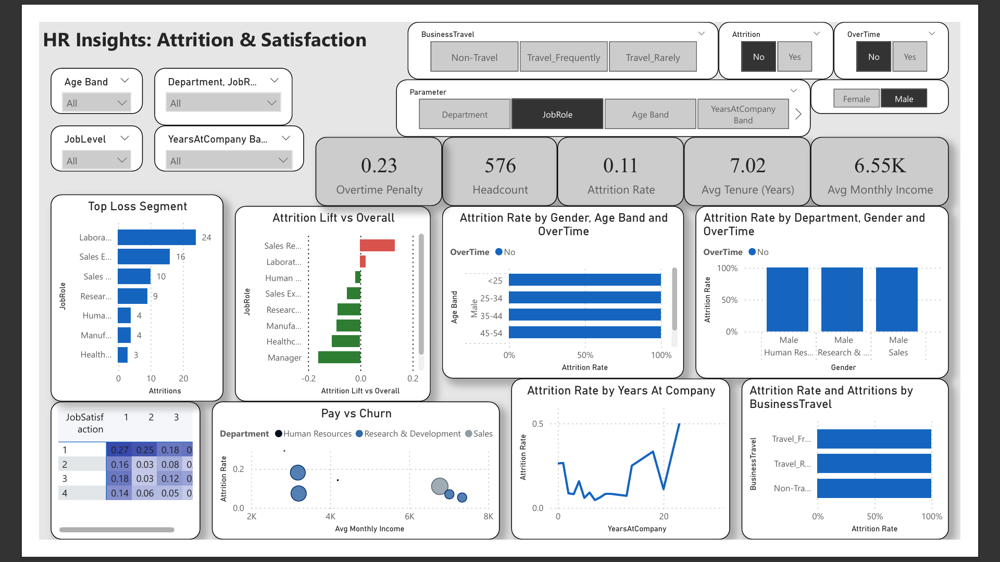
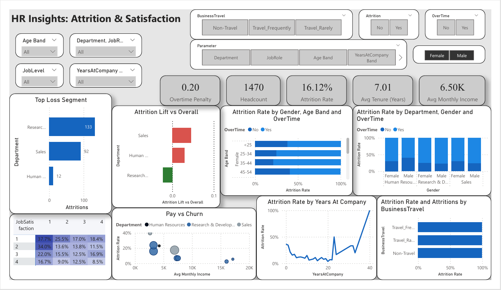

# 👥 HR Insights: Attrition & Satisfaction Dashboard (Power BI)

---

---
## Table of Contents
- [Project Overview](#project-overview)
- [Data Structure](#data-structure)
- [Methodology](#methodology)
- [Key Insights](#key-insights)

---

📊 **Tools Used**: Power BI | Kaggle Dataset  

---

## Project Overview  
To analyze workforce attrition and employee satisfaction trends across departments, job roles, and demographics using **Power BI**.  
The dashboard provides HR teams with actionable insights to reduce attrition, identify high-risk employee groups, and improve overall job satisfaction.  

---

## Data Structure
Features include:  
- Demographics (Age, Gender, Education)  
- Job-related attributes (Department, Job Role, Years at Company, Business Travel)  
- Pay & performance (Monthly Income, Job Satisfaction, Overtime)  
- Target variable: Attrition (Yes/No)  

---

## 📂 Project Files  
- `HR Dashboard.pbix` → Power BI dashboard file
- Dataset: [HR Analytics Prediction Dataset (Kaggle)](https://www.kaggle.com/datasets/rishikeshkonapure/hr-analytics-prediction)  
- `README.md` → Project documentation  
- `Insights_Report.md` → Detailed insights & recommendations  
- 📸 Dashboard screenshot (see below)  

---
## Methodology  
1. **Data Preparation**  
   - Cleaned and standardized records across departments and job roles.  
   - Created DAX measures for:  
     - **Attrition Rate (%)**  
     - **Average Tenure (Years)**  
     - **Overtime Penalty**  
     - **Average Monthly Income**

2. **Dashboard Development**  
   - Implemented interactive slicers for **Department**, **Job Role**, **Age Band**, **Gender**, **Overtime**, and **Business Travel**.  
   - Designed KPIs:  
     - **Headcount:** 1,470 employees  
     - **Attrition Rate:** 16.12%  
     - **Average Tenure:** 7.01 years  
     - **Average Monthly Income:** ₹6.5K  
     - **Overtime Penalty:** 0.20  

3. **Visual Components**  
   - **Top Loss Segments:** Attrition counts by department  
   - **Attrition Lift vs Overall:** Deviation of each department from the mean attrition rate  
   - **Attrition by Gender, Age Band, and Overtime**  
   - **Pay vs Churn:** Income vs attrition relationship  
   - **Attrition by Years at Company and Business Travel**

---

## Key Insights  
- **Research & Development** and **Sales** departments recorded the **highest attrition counts** (133 and 92 respectively).  
- Employees aged **under 25** and those working **overtime** show higher attrition rates.  
- Lower **Job Satisfaction (levels 1–2)** corresponds with over **30% attrition rate**.  
- Longer tenure and higher salary levels correlate with **better employee retention**.  
- For the complete **Insights Report** with findings and recommendations, see 👉 [Insights_Report.md](Insights_Report.md)  
---

## 📸 Dashboard Preview  

---

## 🚀 Business Impact  
- Helped HR identify **top loss segments** and create targeted retention strategies.  
- Improved understanding of **satisfaction drivers** across departments.  
- Enabled continuous monitoring of workforce trends through automated Power BI updates.  
---

## 🚀 How to Use the Dashboard  
1. Download the `.pbix` file from this repository.  
2. Open it in **Power BI Desktop** (free).  
3. Load the Kaggle dataset.  
4. Explore interactive visuals and filters.  

---

## 📫 Connect with Me  
- [LinkedIn](https://www.linkedin.com/in/soorya-k-s-/)  
- 📧 Email: **sooryaks552@gmail.com**  

⭐️ From [Sooryaks237](https://github.com/Sooryaks237)
